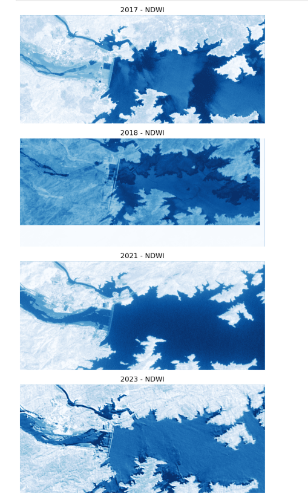
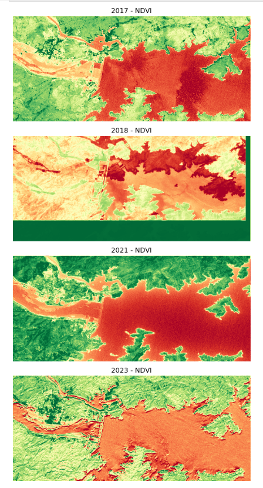

# Satellite-water-body-segmentation
Water body extraction from multi-band satellite imagery using thresholding, preprocessing, and area calculation in Python.

# Satellite Water Body Segmentation & Temporal Analysis

This project focuses on extraction and analysis of reservoir water bodies from multi-band satellite imagery using spectral indices and image processing techniques.
The workflow demonstrates how water spread changes across different years using remote sensing data.

---
## Methodology

- Loaded multi-temporal satellite datasets using Open Data Cube
- Visualized spectral bands (Green, Red, NIR)
- Computed vegetation index (NDVI) for land cover understanding
- Computed water index (NDWI) for water body extraction
- Analysed temporal variation of reservoir water spread

---
## Spectral Indices Used

### NDWI (Normalized Difference Water Index)
NDWI enhances water regions and suppresses vegetation and soil:
NDWI = (Green − NIR) / (Green + NIR)

### NDVI (Normalized Difference Vegetation Index)
NDVI helps distinguish vegetation from non-vegetation regions:
NDVI = (NIR − Red) / (NIR + Red)

---

## Sample Results
### Water Body Extraction (NDWI)

### Vegetation Analysis (NDVI)

---

## Technologies Used
- Python
- NumPy
- Matplotlib
- Open Data Cube
- Remote Sensing Spectral Analysis

---
## Applications

- Reservoir monitoring
- Drought assessment
- Environmental change detection
- Water resource management
